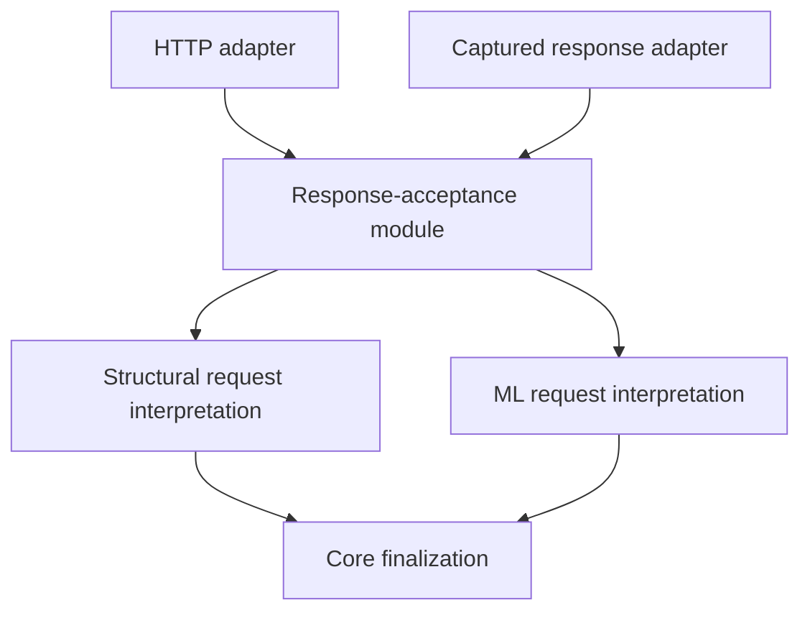

# Plan: deepen judge response acceptance

Status: implemented for architecture recommendation 2 on 2026-09-12. Final validation is recorded below.

## Problem and intended result

Structural review and ML review currently disagree about whether a remote response is complete and
unambiguous. Structural review extracts the first expected tool call and loses duplicate JSON fields
before schema validation; ML review requires completed tool use, exactly one expected call, and raw
tool input. A response containing a valid first call plus another call can therefore reach structural
interpretation while ML review rejects the same envelope shape.

The change should make both paths use one response-acceptance module. An unacceptable response must
preserve the findings that response would have reviewed and add a coverage gap. A valid response must
produce the same interpretation and authority-dependent result as before.

Evidence from the pre-refactor tree (historical locations):

| Location | Relevant behavior |
|---|---|
| `src/client.rs:206` | Structural response becomes `serde_json::Value` before extraction. |
| `src/client.rs:317` | Extractor accepts the first expected tool call without completion or cardinality checks. |
| `src/response.rs:145` | Structural schema validation receives a `Value`, after duplicate fields have disappeared. |
| `src/ml_review.rs:320` | ML envelope parser checks completion and exactly one expected call. |
| `src/ml_review.rs:502` | ML envelope retains raw tool input with `RawValue`. |
| `src/lib.rs:290` | Structural orchestration maps validated answers to evidence and constructs a bound report. |
| `tests/support/mod.rs:137`, `../cli/tests/judge_cli.rs:542` | Successful structural mock responses omit `stop_reason`. |
| `tests/ml_review.rs:307`, `:672` | Existing ML regressions exercise incomplete/multiple calls and duplicate fields. |

## Ownership and interface direction



- Add a private `src/envelope.rs` module owning raw-envelope decoding, completion checks, call
  cardinality, expected tool identity, and response-size enforcement. Its interface takes the raw
  response and a fixed per-route contract, and returns raw tool input or a bounded error.
- Keep structural and ML payload interpretation separate: they have different schemas, evidence,
  and scope-validity rules. Both cross the same envelope seam.
- Give the structural request a raw-envelope-to-bound-report operation, analogous to the existing
  ML request path. Move answer-to-evidence mapping and report assembly out of `Judge::review_routed`
  behind that request interface; retain scoring in the existing scoring implementation.
- Keep HTTP/status handling and credentials in `client`; keep verdict changes and release authority
  in core finalization. No new crate, runtime, transport abstraction, or dependency is needed.

This produces **locality** for acceptance policy and **leverage** for shipping and captured-response
callers. Deleting the existing first-call extraction handoff removes caller coordination; deleting
core finalization or request binding would scatter real invariants, so those modules earn their keep.

## Acceptance contract

| Response shape | Result |
|---|---|
| Completed `tool_use`, exactly one expected call, valid request-bound payload | Accept. |
| Harmless text blocks alongside that call; additional provider envelope metadata | Accept without interpreting the prose. |
| Missing/null completion reason, `max_tokens`, or any reason other than `tool_use` | Reject the response. |
| Zero calls, multiple calls, or an unexpected tool name | Reject; never select the first or best-looking call. |
| Missing/null/wrong-shaped tool input or malformed/trailing JSON | Reject. |
| Duplicate protocol fields or duplicate schema fields in tool input | Reject before conversion to `Value` can erase the ambiguity. |
| Unknown payload fields/enums or missing, duplicate, or foreign evidence IDs | Reject through the existing route-specific schema and request checks. |
| Response over its route's byte limit | Reject on HTTP reads and captured-response application alike. |

Preserve the existing limits initially: structural responses are bounded at 10 MiB, ML responses at
64 KiB. Name these contracts centrally and apply each consistently; choosing tighter limits is a
separate behavior change requiring evidence. Preserve existing tolerance for ignorable envelope
metadata while keeping decision-bearing protocol fields strict.

New envelope errors must not include raw response text, tool input, credentials, or attacker-supplied
field values. Raw captures remain available only through the existing explicit capture operations.

## Implementation sequence

### 1. Establish valid fixtures and baseline behavior

Update successful structural response fixtures to include `stop_reason: "tool_use"`. Search judge,
CLI, and combined-route fixtures; keep intentionally incomplete responses visibly separate. Record
valid response outcomes for ordinary, contextual, ML-only, and combined review under both advisory
and release authority.

Acceptance: current happy-path and fail-closed tests remain green. Adding completion metadata changes
fixture validity, not expected scoring. No live judge calls are needed.

### 2. Extract shared envelope acceptance and migrate ML

Move the existing ML envelope behavior into the private module, preserving `RawValue` through the
handoff. Centralize the fixed tool names/limits used by each route without constructing a generic
plugin mechanism. ML request parsing delegates envelope acceptance and retains its own payload checks.

Test first: completed single call, prose plus call, harmless extra metadata, missing completion,
truncation, extra expected/unexpected calls, duplicate protocol fields, missing input, malformed JSON,
and exact-limit/over-limit responses. Keep ML's existing duplicate-payload-field regression.

Acceptance: ML decisions and failure behavior remain equivalent; its private envelope structs and
independent acceptance implementation disappear.

### 3. Route structural review through raw acceptance and request binding

First add failing structural tests demonstrating that incomplete responses, multiple calls, and
duplicate payload fields are rejected with a coverage gap and retained findings. Use raw JSON strings
for duplicate-field cases; constructing a `Value` would destroy the condition being tested.

Switch both ordinary and contextual structural review to obtain raw response bodies. Decode typed
structural payloads directly from accepted raw tool input, then validate their exact evidence IDs.
Concentrate the existing scoring/mapping/report construction behind the structural request interface.
`Judge::review_routed` then coordinates request creation, transport, interpretation, and finalization.

Preserve public `Value`-based helpers used by experiments and tests as compatibility adapters where
practical. They must share payload validation, and shipping review must use the raw path exclusively.
Document that a `Value`-only helper cannot establish properties of the original envelope or recover
duplicate fields. `send_with_schema` must still support calibration experiments without exposing
credentials, and must use shared envelope acceptance before returning its compatibility result.

Acceptance: every shipping structural ingress rejects ambiguous envelopes; valid outcomes and
request binding are unchanged; the old first-match extractor is deleted.

### 4. Verify both adapters and combined review

Exercise the same malformed-envelope matrix through captured-response and mock-HTTP paths, using
valid payloads for each route. Add integration assertions that rejection preserves retained findings,
suppressed findings, existing gaps, policy, and calibration even when display limits are zero.

Keep ordinary and ML scope semantics distinct. In combined review, each response is accepted or
rejected independently: rejection cannot authorize changes, while a different valid response may
still act within its own caller-granted authority. Test both failure orders and preserve the existing
ML mapping captured before structural demotions.

Acceptance: no transport or capture path bypasses the common checks, no prose appears in new error
details, and advisory/release semantics and credential isolation remain covered.

### 5. Record the behavior change and remove stale descriptions

Add a response-acceptance version and the response limits to judge inference metadata. Requests,
prompts, schemas, and scoring need not change; request-recipe hashes alone cannot identify changed
response interpretation. Assert that the new metadata is present without publishing credentials.

Update the judge contracts and relevant comments with the stricter structural completion requirement,
capture behavior, limits, and compatibility helper semantics. Document that malformed proxy responses
previously accepted by structural review now produce a gap. Historical captures lacking completion
metadata fail validation; do not synthesize completion or silently repair them. Use fresh evaluation
run labels for measurements made under the new acceptance version.

Acceptance: contracts describe the implemented behavior, metadata distinguishes the new acceptance
rules, and only one module owns the envelope acceptance implementation.

## Validation

Run focused new regressions during implementation, then:

```sh
cargo test -p please-judge
cargo test -p please-core --test review_binding --test ml_merge --test compile_fail
cargo test -p please-cli --test judge_cli
cargo test -p please-scan --features judge,ml-candle
cargo test --manifest-path crates/eval/Cargo.toml --features shipping-judge,shipping-ml --test product
cargo clippy -p please-judge -p please-cli -p please-scan --all-targets --features please-cli/ml-candle -- -D warnings
cargo fmt --all --check
bash ci/check-no-credential-leak.sh
bash ci/check-core-isolation.sh
bash ci/check-dependencies.sh
```

Mock HTTP tests need permission to bind local sockets in restricted environments. The standard test
run must continue to leave live-provider tests ignored. No remote accuracy claim follows from parser
tests; valid-input equivalence and explicit malformed-input rejection are the completion criteria.

## Decisions preserved

- Constitution I/V and 004 plan D1/D2/D10: core stays offline, the judge remains synchronous, and
  descriptive report vocabulary stays in core while transport remains in judge.
- Current review-authority and request-binding decisions: advisory by default, release only with
  caller authority, exact ordinary binding, and the intentionally different ML scope semantics.
- Existing prompt wording, tool schemas, model selection, score calculations, and calibration
  experiments: the acceptance refactor does not require changing them.

No existing decision needs reopening for this plan. The intentional compatibility change is rejecting
structural responses whose completeness or unambiguity cannot be established.

## Implementation and validation — 2026-09-12

Implemented the private `src/envelope.rs` module and routed structural, contextual structural, and ML
review through it. `JudgeRequest::parse_envelope` now owns structural schema validation, request
binding, scoring, and report assembly. Compatibility `Value` helpers remain documented; shipping
review retains raw JSON throughout acceptance. Inference metadata records acceptance version
`2026-09-12.1` and both existing response budgets.

Regression tests cover captured and mock-HTTP envelopes, duplicate protocol and payload fields,
completion/cardinality failures, schema and evidence mismatches, ignored metadata/prose, bounded
errors, both authority modes, zero display limits, prior gaps, and independent combined responses.
The exact-limit tests exposed ureq's EOF check at the limit: HTTP reads now reserve one byte for
that check and enforce the inclusive contract limit before returning a body. Exact-limit bodies
pass and limit-plus-one bodies fail for both routes.

Validation passed:

- Judge suite, including the new response acceptance and expanded ML tests, in the workspace gate.
- Core review binding, ML merge, and compile-fail tests.
- CLI judge tests and scan tests with `judge,ml-candle`.
- Evaluation product tests with `shipping-judge,shipping-ml`.
- Clippy for judge, CLI, and scan with warnings denied; workspace formatting and diff checks.
- Core isolation and dependency allow-list checks.
- Workspace credential-leak gate: all tests passed, no canary values in 1,032 output lines.

Mock HTTP tests ran outside the socket-restricted sandbox. Live-provider tests remained ignored;
these results establish acceptance behavior, not remote model accuracy.
