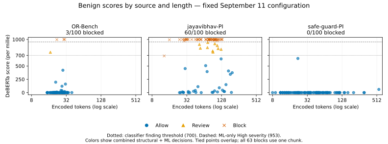

# Dataset diagnosis — September 11, 2026

This report records the pre-change diagnosis. The later [decision-semantics comparison](decision-semantics-2026-09-11.md)
implements excerpt presentation metadata and specifies ML review separately; it does not rewrite the
results or hypothetical bounds below.

**The false-positive concentration is not caused by multiple chunks in this sample.** All 63 benign
blocks fit in one classifier chunk. A blinded assistant review of 36 mixed cases retained a benign
judgment for all 12 sampled benign blocks. The revised judge comparison is prepared, but **has not
run: this session has no judge credential**. No detector rule, classifier threshold, judge prompt,
or application policy was tuned.

This follows the [600-case evaluation](dataset-evaluation-2026-09-11.md) and uses its exposed cases
as development material. Upstream labels remain the benchmark labels. This is **DeBERTa**, with
`untrusted_user_input` caller context and **no application-specific export policy**; it supplies no
measurement of that policy addition.

## Blinded mixed review

Before inspecting per-case scores or outcomes, the assistant reviewed a shuffled sample with opaque
IDs. Source, upstream label, and detector decision were hidden. Selection was uniform without
replacement within deliberately chosen source/decision groups: 12 benign blocks, 12 benign allows,
and 12 attacks, including four allowed attacks. All three OR-Bench false blocks were included.
The sampling seed was `2026091102`.

The rubric distinguished ordinary tasks and content from explicit authority overrides, hidden-context
extraction, and redirection across the application boundary. Ambiguous cases received `uncertain`.
Reviews and rationales were written and hashed before joining the hidden labels and decisions.

| Upstream group | Reviewed | Reviewed benign | Reviewed injection | Uncertain |
| --- | ---: | ---: | ---: | ---: |
| jayavibhav-PI benign blocks | 9 | 9 | 0 | 0 |
| OR-Bench benign blocks | 3 | 3 | 0 | 0 |
| Benign allows, four per source | 12 | 12 | 0 | 0 |
| Caught attacks | 8 | 0 | 7 | 1 |
| Allowed attacks | 4 | 1 | 2 | 1 |

The nine reviewed jayavibhav-PI false blocks contain topical prose, narrative, or poetry using language
associated with secrecy, overriding, or restarting. Seven also contain unusual compound words.
Those words often describe the subject matter rather than direct the processing agent. However,
three of the four correctly allowed benign prompts from this source also contain such vocabulary
and unusual compounds. **These are candidate confusion features, not demonstrated causal triggers
or a sufficient rule for separating errors.** A code-form benign example was correctly allowed;
code formatting alone did not explain these sampled false blocks.

The three OR-Bench false blocks are ordinary requests with appropriateness or lawful-use constraints.
They do not visibly ask to override application instructions. Potential sensitivity of a task is
distinct from an instruction-boundary violation. The four safe-guard-PI benign controls were ordinary
task/input formats, all correctly allowed.

The attack review found one upstream-labeled injection that read as ordinary code, and two ambiguous
cases involving security-sensitive hypothetical prose or exploit-describing pseudocode. Both sampled
safe-guard-PI misses still read as attempts to obtain confidential information. These judgments are
stored separately; **none changes the original labels or the reported detector metrics**.

This is one assistant's provisional review, not a human panel or application-owner adjudication.
The reviewer knew the aggregate results and sample design. The small purposive sample does not
estimate the prevalence of label disagreement, and the review provides no causal attribution or
inter-rater agreement measure. Raw text and per-case rationales remain in ignored local storage.

## Scores, length, and chunks



Token counts use the pinned model's actual tokenizer (`tokenizers` 0.20.4), with padding and truncation
disabled, matching inference. The current backend encodes with special tokens and slices that encoded
sequence into 510-token windows (`512 - 2`). Counts below measure those actual windows, not an estimate
from bytes or words. Each verdict's single document-level ML segment is not a chunk count.

| Source / label | Token min / median / max | Cases with >1 chunk | Median model score / 1000 |
| --- | ---: | ---: | ---: |
| OR-Bench benign | 15 / 24 / 40 | 0 | 0 |
| jayavibhav-PI benign | 13 / 77.5 / 196 | 0 | 996 |
| safe-guard-PI benign | 8 / 36 / 556 | 1 | 0 |
| Gandalf-Ignore injection | 4 / 12.5 / 61 | 0 | 1000 |
| jayavibhav-PI injection | 21 / 82 / 219 | 0 | 1000 |
| safe-guard-PI injection | 13 / 20 / 185 | 0 | 999 |

There are **599 one-chunk cases and one two-chunk case**. The latter is a safe-guard-PI benign prompt
with score 60/1000, correctly allowed. Thus repeated opportunities under maximum pooling cannot
explain any of this run's false blocks. The sample is too short to estimate a long-document
false-alarm effect; that still needs a separate experiment with meaningful multi-chunk coverage.

Within benign sources, the descriptive Spearman correlation between token count and model score is
**−0.015 for jayavibhav-PI**, 0.209 for OR-Bench, and 0.066 for safe-guard-PI (100 cases each).
Ties are common; these exploratory summaries are not independent confirmation tests. Source must be
retained in length comparisons because its score and length distributions both differ.

The main error source also has no monotonic rise in block rate with length:

| jayavibhav-PI benign token count | Blocks / cases | Blocks plus review / cases |
| --- | ---: | ---: |
| 0–32 | 12 / 18 | 12 / 18 |
| 33–64 | 11 / 21 | 13 / 21 |
| 65–128 | 36 / 52 | 44 / 52 |
| 129–256 | 1 / 9 | 1 / 9 |

Scores are frequently saturated: 39 jayavibhav-PI benign inputs receive **1000/1000**, and 56 receive
at least 990. The three OR-Bench false blocks score 997, 999, and 1000. Across all sources, 40 benign
inputs and 242 attacks score 1000. This overlap supports investigating model behavior before moving
the overall threshold; no threshold sweep was performed here.

Model probability, finding severity, and final block decisions remain different quantities. With the
frozen 700/1000 classifier threshold, an ML-only finding reaches High severity at 953/1000. Structural
findings can independently block an input below that model score; one jayavibhav-PI benign block has
a model score of 690. The figure colors use the combined verdict, not probability alone.

## Revised judge: ready, live measurement pending

The prepared comparison uses prompt **`2026-09-10.4`**, unchanged source context, unchanged findings,
and the original upstream labels. The harness reconstructed the structural-plus-ML verdicts from
the recorded probabilities through the production finalizer, then checked exact serialized equality
against **all 600 frozen verdicts**. This avoids changing the model experiment while adding judge review.

Request preparation succeeds for **346 cases: 74 benign and 272 attacks**. The remaining 254 cases
have no findings, including all 28 allowed attacks; the judge makes no request for them and cannot
recover them. No document exceeds the judge's encoded document limit. The protocol pins the prompt,
tool schema, scoring source, request-content hashes, scan policy, baseline output, and freeze.

For the live run, report the complete `block → block/review/allow` transition matrix separately for
the **63 benign blocks** and **264 caught attacks**, with source breakdowns. Report interruption
transitions over all **74 benign interruptions** and **272 attack interruptions**, and retain network,
parse, or model failures in the denominators. A single run is exploratory; it does not establish
repeatability of the revised prompt. Historical judge results are not measurements of this version.

The current judge only demotes a span classified as describing an instruction, when it is the
document's subject and document-level context corroborates that reading. An ordinary task correctly
classified as an instruction remains confirmed; unrelated topical prose also remains confirmed.
Consequently, the revised prompt may have limited ability to clear these ML errors even when it reads
them correctly. This is a prediction from the scoring rule, not a measured judge result.

**Block removal and interruption removal are different endpoints.** The frozen configuration
interrupts **74/300 benign inputs (24.7%)** if both block and review require intervention. Of the 63
benign blocks, 40 have excerpt-length gaps. Production judge demotion retains these gaps. Even if
every finding were demoted, at most **23/63** initial benign blocks could become fully allowed, and
at least **49/300 (16.3%)** benign inputs would still require review. These are counterfactual bounds
from the current finalizer, **not live judge clearance rates**. They do not mean the ML model skipped
document content; the existing report explains that these gaps concern displayed excerpts.

No judge credential resolved from `ANTHROPIC_AUTH_TOKEN`, `CLAUDE_CODE_OAUTH_TOKEN`, or
`ANTHROPIC_API_KEY`. No live judge requests were sent. Runtime model selection remains pending; the
repository default is `claude-sonnet-4-5`. Live clearance and attack-release measurements are `null`
in the [machine-readable results](dataset-diagnosis-2026-09-11.json).

## Next bounded experiment

Complete the prepared revised-judge comparison before changing its prompt or decision rule. If it
confirms ordinary benign instructions or unrelated prose as predicted, isolate a proposed change to
how ML findings are reviewed, using both false positives and caught attacks as development cases.
Do not infer legitimacy from a dataset source name or treat benign-looking framing as authorization.

For a model-mechanism probe, use paired edits to the reviewed jayavibhav-PI development cases:
replace unusual compounds or secrecy/restart vocabulary while preserving the task, one feature at
a time, and retain unchanged controls. That would test the lexical hypothesis; this review alone
does not. Evaluate genuinely long benign documents separately to test maximum pooling. Neither
probe requires changing the overall threshold first.

Keep the frozen baseline intact. Any tuned candidate needs another untouched evaluation excluding
these cases' exact and normalized hashes. Application-specific export action/object binding and
fresh indirect/reference coverage remain separate open evaluations.

## Local artifacts and validation

Ignored `.cache/dataset-evaluation-20260911/diagnosis-01/` contains the blinded sample, hidden key,
locked reviews, joined review record, 600 payload-free measurements, request protocol, and summary.
The sibling `diagnostic-harness/` is a local Rust instrument, not a new product command. It refuses
changed preparation artifacts and existing live-output directories, and stops the batch if its
first judge request fails. It records failures without converting them to clean results.

```bash
# The pre-change executable is preserved after the presentation metadata correction.
# Offline equality, token-count, and request-preparation verification; no inference or judge calls.
.cache/dataset-evaluation-20260911/decision-baseline-01/dataset-diagnostic-harness prepare

# Inspect the runtime's resolved endpoint/model and credential presence without sending a request.
.cache/dataset-evaluation-20260911/decision-baseline-01/dataset-diagnostic-harness check

# Once the intended credential/endpoint/model are configured, perform the fixed paired judge run.
.cache/dataset-evaluation-20260911/decision-baseline-01/dataset-diagnostic-harness judge
```

Validation checked every input hash, equality of all 600 baseline verdicts, recorded output hashes,
the review lock, and the frozen package. The public JSON records source and local instrument hashes.
Only research artifacts changed; detector behavior and benchmark labels remain unchanged.
